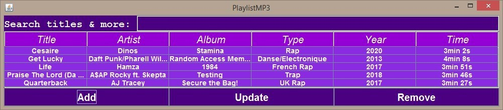

# Playlist

The project's objective is to create a playlist of music files in the MP3 (Moving Picture Experts Group Audio Layer 3) format.  
The playlist is in XSPF format (XML Shareable Playlist Format).  
For each MP3 file, the software is able to display the main metadata.  
The software runs in console (terminal) mode with predefined parameters and in "GUI" mode.  
Licence 2 project made for the Programmation Oriented Object cursus at CY Paris Université.  
Made with Lelievre Saidou.

Here, the GUI Interface of our playlist :  

